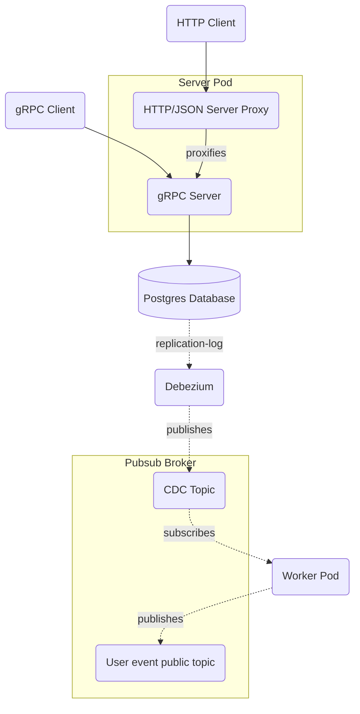

# Faceit Take home assignment

## Dependencies

This repository contain a microservice written in Go that can be completely compiled using Docker amd Make. 

## Make targets 

By simply typing 'make' you will get a (hopefully) self-describing list of targets:

```shell
$ make
Usage:
  generate            generates the grpc go sdk and openapi spec.
  vendor              vendor dependencies for faster running/compilation.
  build               builds the binaries into the bin dir. 
  migrate_up          initialises and run the migrations on the database.
  migrate_down        tears down the database migrations.
  dependencies_down   tears down the containerised environment necessary to run component-test against.
  dependencies_up     starts the containerised environment necessary to run component-tests against.
  component_tests     runs component tests against a locally running server and worker. user must run dependencies_up and start the process themselves. [needs Go 1.20]
  ci                  starts the containerazed environment and run tests against it inside the `test` container.
  help                prints this help message.
```

## 

## Design choices, motivations and interesting discussions

### Architecture diagram



### PII and Password storage

The data that is being stored in the database contains two types of sensible data:

1. PII data - Personally Identifiable Information - this kind of information storage and handling is heavily regulated in some parts of the world. 
In a real product, we should consider how to protect this kind of data. Points that should be considered:
    1. The service should never log this data.
    2. Data encryption at rest - some databases/providers feature disk encryption at rest
    3. Strong authentication/authorization for accessing the read-operations - mutual TLS and authorization probably also to be considered in internal service-to-service calls.
    4. Client-side encryption - depending on our requirements and specifications, we could/should consider to use client-side encryption for this data before storing in the database.
    This choice would have another set of interesting discussions: KMS, libraries and eventually considering envelop-encryption to avoid having a KMS in the service critical-path. 
    Client-side encryption also creates challenges for querying data in the database often leading to more convoluted solutions and database schemas (deterministic hashing way to allow querying it without storing in clear).

2. Passwords - passwords should never be stored in clear, and also shouldn't be stored encrypted due to the risk of compromises. In the solution I used the argon2 strong-cryptographic random hash for storing the password in the database. For more information of the award-winning password-hashing solution you can see [here](https://pkg.go.dev/golang.org/x/crypto/argon2). 
Also input validation for password is typically something that is required in a real service. I have ignored this aspect again due to time-constraints.
A reputable publication containing rules around this topic can be found [here](https://pages.nist.gov/800-63-3/sp800-63b.html#appA).

### Email

Typically the email field should go through a more robust validation, frequently this would be done through a 2-step verification process (sending an email to the user so that he can confirm control over it).
This has been ignored in this solution for time constraints. 

### Input Validation

In this solution, input validation is done by using [protoc-gen-validate](https://github.com/bufbuild/protoc-gen-validate) protobuf validation plugin. This method allows for a more declarative approach for validation as it leverages 
the code generation process to automatically generate validation code. This is not a sufficiently exhaustive input-validation and in a real application it is frequently not sufficient. For the sake of simplicity
in this solution, we will only use this. 

### Pagination

There are 2 techniques that are pretty common to implement pagination: offset-based and cursor-based. Both have benefits and drawbacks, I have chosen the offset-based as it is simpler to implement in the Backend, although less performant. 

### Wiring and DI

Withing this simple project, I did not bother creating a sophisticated wiring or DI (dependency-injection) mechanism featuring factories and so on. All the concrete implementations are instantiated in the `main.go` file and wired into the dependant service. This rudimentary DI mechanism still follows the go idiom [accept interfaces and return structures](https://bryanftan.medium.com/accept-interfaces-return-structs-in-go-d4cab29a301b). There is also an argument to be made in the microservice world that if the wiring of a service starts to become too complex and verbose, maybe it's a sign that your service might be crossing the micro-macro-service border :sweat_smile: and could be a good time to start considering splitting it (or not :sweat_smile:).

### CDC - Change data [capture](https://en.wikipedia.org/wiki/Change_data_capture)

1. better horizontal scalability than outbox - different consumer pods can split work easily than a cron schedule. 
2. data is streamed as it is committed to the db (to potentially multiple pods) which spread the resources-load (network, cpu, etc) compared to a bulk-job.
3. user code remains simpler as it inherits the retrial policy from the publish-subscriber platform (kafka or in this case pubsub). User-code just needs to worry about the event-handling and publishing.

### Project structure

```sh
➜ tree -I 'vendor|bin|coverage' -d
.
├── cmd 
│   ├── migrate # utility executable for running migrations (up/down) present in `db/migrations`
│   ├── pubsubsetup # utility executable for creating topics/subscriptions on pubsub container
│   ├── server # executable containing the gRPC user-CRUD server
│   ├── waitfor # utility executable used to wait for containers to be ready and listening on TCP ports
│   └── worker # executable containing the pubsub CDC consumer
├── db
│   └── migrations # SQL migration files - schema/index definitions on the Postgres database
├── internal # all internal functionality that is not supposed to be used outside the scope of the repo
│   ├── actors # contains the protocol-specific code that interacts with `core`
│   │   ├── grpc # contains the grpc server code
│   │   ├── postgres
│   │   └── pubsub
│   │       ├── producer # contains the pubsub producer/publisher
│   │       └── subscriber # contains the pubsub CDC subscriber
│   └── core # contains the business logic not corrupted with protocol-specific concerns
│       ├── model # contains the domain models
│       ├── ports # interfaces defining how the communication between an actors and the core is done
│       └── usecase # core main business functionality
├── openapiv2 # openapi specs generated from the protobuf schema 
├── pkg # code that is supposed to be used from repositories that do not belong to this repository (this package is go gettable)
│   └── sdk 
│       └── v1 # contains the generated go code from the protobuf schema
├── proto
│   └── v1 # contains the protobuf schema definition
└── tests
    └── component # contains component-tests
```

### Logging

I made the code quite silent in terms of logging - the service will basically only log unexpected server errors. This goes also hand-in-hand with how I have done error-handling:

if an error is not recoverable it will be returned (more frequently than not wrappedL) to the caller. If the error reaches the top of the applicative call-stack (grpc server or pubsub consumer), 
the error will be logged and translated to proper protocol-specific error (grpc/http status code). 
The minimal presence of logs is a deliberate choice and the goal with it would be: 
1. avoid creating noise that makes production issues investigation harder (specially in microservice world where an investigation typically involves several services);
2. make the code more easier to read - more concise and with less distractions to the reader;
3. [bonus] log can became quite expensive in the cloud when ingested by vendors;

### BDD and component tests

I have included a set of component tests with a minimal BDD-style framework. Those tests are more expensive to maintain and run than unit tests and are not meant to reach high code-coverage or grow a lot in number. 
On the other hand, they can catch different kinds of faulty behavior than unit-tests while providing a business-friendly way of describing and asserting behavior. 
The component tests are a suite of tests that interact with the server/worker as a client, if you refer to the architecture diagram, the component_test impersonates a gRPC client to make requests to the grpc server
and it also contains a subscriber to the public UserEvent topic so that it can perform assertions that a given operation (user creation/update/delete) will generate the appropriate event.  

### Why 2 executables (server/worker)

The main reason why I decided to separate the server from the worker is because I deemed that the traffic load and characteristics that they would be subjected could differ significantly
and therefore in a real application it would be very desireable to being able to scale them independently. There are also other interesting aspects about that - deployability independence is
one that is worth mentioning as well. 

### HTTP/JSON to gRPC transcoding

Transcoding HTTP/JSON to gRPC enables access your gRPC API by using HTTP/JSON. This is a very convenient way of:

1. Describing your APIs in protobuf format which is more compact than openapi.
2. Exposing your gRPC services in HTTP/JSON for clients that can't access your APIs using protobuf. Specially interesting for javascript/browser clients.
3. Do not incur in maintenance cost for supporting both protocols concurrently. 

I have also leverage on this feature to support the `healthz` endpoint which exposes information about the app health - useful for proper k8s probes configuration. 

[grpc-gateway](https://github.com/grpc-ecosystem/grpc-gateway)

### Generating Go files from `proto` schema with [Buf](https://buf.build/docs/)

Buf provides several advantages over protoc for compiling your proto files, here are some:

1. built-in support for dependency management. 
2. more powerful linting.
3. integration with protobuf schema registry.

### Coverage and Component tests

An awesome feature introduced in go 1.20 was the [Coverage profiling support for integration tests](https://go.dev/testing/coverage/). With this feature, we are able to 
include `main.go` and other packages that are only involved in application startup in our coverage reports. 
You will find that by running `make ci`, the final output is the result of the combined coverage between all the executables and unit-tests in this repository. 

Given the time constraints I deliberately decided to not create unit-tests for simple files/functions and privileged the integration of this nice feature 
which will also include the coverage that arises from the component-tests. 

### Running tests / CI

There are 2 ways you can run all the tests in the repo:

1. locally [only need docker]: `make ci`
2. I have added a github action for doing that if you want to check out the output of the test.
